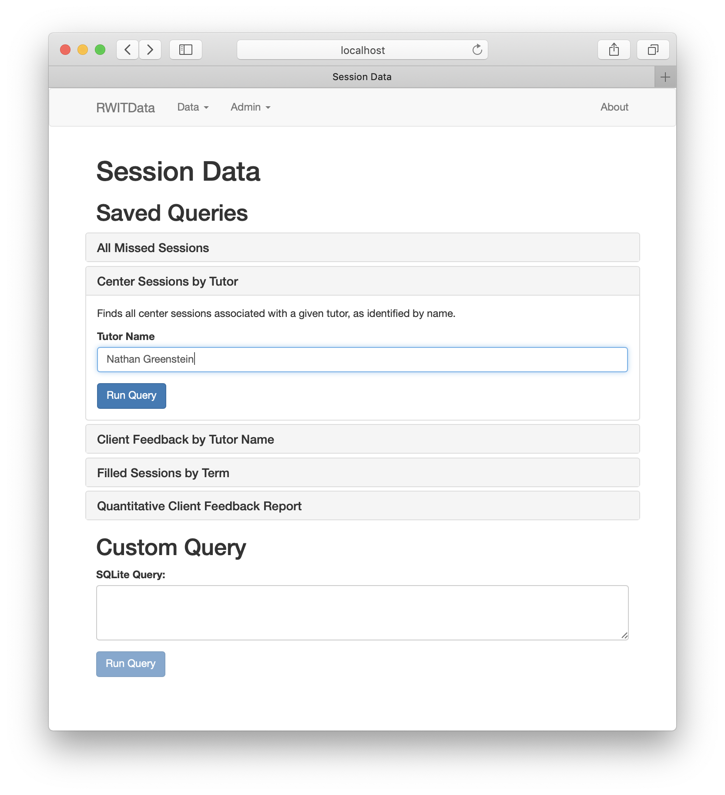

# RWITData

## About

RWITData helps tutors explore data from [RWIT](https://students.dartmouth.edu/rwit/), Dartmouth's student writing center. It aims to facilitate institutional research and administrative tasks by laying an accessible interface over the complex records produced by RWIT's LMS.

## Installation

1. Install Python 2.7 for your platform following the [directions on python.org](https://www.python.org/downloads/).
2. If you haven’t already, download the [RWITData repository](https://github.com/ngreenstein/RWITData) from GitHub
3. Run the `RWITData.py` script in the root folder of this repository. To run a Python script, follow directions after the “Now that you've written your first program, let's run it in Python!” line of [this page](https://en.wikibooks.org/wiki/Python_Programming/Creating_Python_Programs). Replace folder paths and file names with the location of the RWITData repository on your computer and the `RWITData.py` script name. E.g. `cd ~/Desktop/RWITData; python ./RWITdata.py`
4. Open your browser to [http://localhost:8888](http://localhost:8888)

## Recommended Workflow

*Note: since E&O support is not yet fully implemented, the following directions refer to session data exclusively.*

Upon first use:

1. Download CSV file of *all sessions* from RWIT Online
2. Import the CSV into RWITData (Admin -> Sessions), replacing the database
3. Perform desired query/queries (Data -> Sessions)
4. Export query results as CSV (from the Results page)
5. Feed resulting CSV file(s) to statistical analysis software (e.g. Stata) and evaluate trends or otherwise analyze results

When a new term’s session data is available:

1. Download the *new term’s* CSV data from RWIT Online
2. Import the CSV into RWITData, *adding* to the database
3. Repeat above steps (3) through (5) to perform analyses taking new data into account

For sharing data with a new user:

1. Existing user: Export database as SQLite (Admin -> Sessions)
2. Existing user: Send resulting file to new user
3. New user: Import database from said file (Admin -> Sessions), replacing database
4. Either user: After adding new data or otherwise making changes to the database, repeat this process.  
**Important: to avoid conflicts, ensure that only one user is making changes to the database at once.**

## State of Completion

### Implemented

- Browse, customize, and execute saved queries
- Compose and execute custom queries
- View, filter, and sort query results
- Export query results as CSV files
- Import sessions data from RWIT Online CSV files (either adding to or replacing the existing database)
- Import sessions data from SQLite files created by RWITData (either adding to or replacing the existing database)
- Export sessions data for all terms or selected terms as SQLite files

### Not Implemented

- Import E&O data (meaning that, in effect, RWITData is currently limited to use on sessions data)
- Export databases as CSV files
- 'About' page

### Known Issues

- Custom queries are given full read/write permission, meaning that users can execute destructive queries
- When importing sessions data, duplicate sessions will be created if a session in the source data already exists in the database

## Misc Info

License: BSD

To freeze, install [cx_Freeze](https://anthony-tuininga.github.io/cx_Freeze/) and run `python setup.py build`.

To run the frozen app, find the RWITData executable and run it. Keep the other files/folders in the build directory intact.